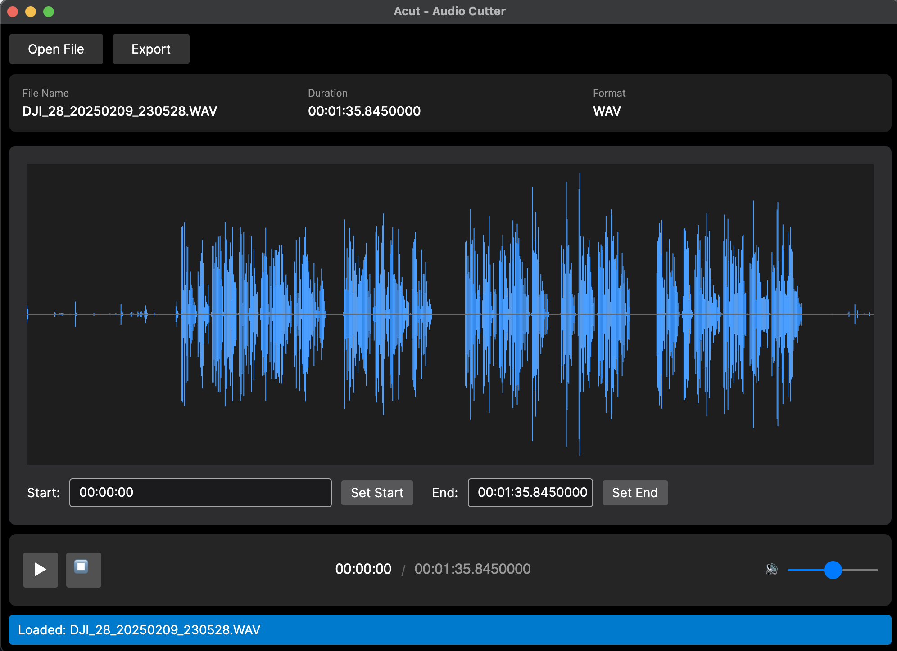

# Acut - Audio Cutter (vibe coding)

A cross-platform desktop application for cutting and exporting audio files, built with C# and Avalonia UI. Designed primarily for macOS but works on Windows and Linux as well.



_Capture of Acut showing waveform preview and export options._

## Features

- **Multiple Format Support**: MP3, WAV, FLAC, AAC, OGG, M4A
- **Waveform Visualization**: Visual representation of audio for precise editing
- **Precise Cutting**: Trim audio with millisecond precision
- **Audio Playback**: Preview audio before exporting
- **Format Conversion**: Export to different audio formats
- **Modern UI**: Clean, intuitive interface with dark theme
- **Cross-Platform**: Runs on macOS, Windows, and Linux

## Architecture

The project follows a clean architecture pattern with separation of concerns:

```
Acut/
├── src/
│   ├── Acut.Desktop/      # Avalonia UI application (MVVM)
│   │   ├── Views/         # XAML views
│   │   ├── ViewModels/    # View models with CommunityToolkit.Mvvm
│   │   ├── Controls/      # Custom controls (WaveformControl)
│   │   └── Converters/    # Value converters
│   ├── Acut.Core/         # Core business logic
│   │   ├── Audio/         # Audio processing services
│   │   ├── Models/        # Domain models
│   │   ├── Formats/       # Format handlers
│   │   └── Export/        # Export functionality
│   └── Acut.Common/       # Shared utilities
└── tests/                 # Unit tests (to be added)
```

## Prerequisites

- .NET 6.0 SDK or later
- FFmpeg (required for audio processing)

### Installing FFmpeg

**macOS:**
```bash
brew install ffmpeg
```

**Windows:**
```bash
choco install ffmpeg
```
Or download from [ffmpeg.org](https://ffmpeg.org/download.html)

**Linux:**
```bash
sudo apt install ffmpeg  # Debian/Ubuntu
sudo dnf install ffmpeg  # Fedora
```

## Getting Started

### Clone and Build

```bash
# Clone the repository
cd Acut

# Restore dependencies
dotnet restore

# Build the solution
dotnet build

# Run the application
dotnet run --project src/Acut.Desktop/Acut.Desktop.csproj
```

## Usage

1. **Open Audio File**
   - Click "Open File" button
   - Select an audio file (MP3, WAV, FLAC, AAC, OGG, M4A)
   - The waveform will be displayed

2. **Set Cut Points**
   - Enter start time in format: `mm:ss.fff`
   - Enter end time in format: `mm:ss.fff`
   - Or use the waveform visualization (to be enhanced)

3. **Preview**
   - Click play button to preview the audio
   - Use volume slider to adjust playback volume
   - Click stop to reset playback position

4. **Export**
   - Click "Export" button
   - Choose output format and location
   - Wait for export to complete

## Technology Stack

### UI Framework
- **Avalonia UI 11.3**: Cross-platform XAML-based UI framework
- **CommunityToolkit.Mvvm**: Modern MVVM implementation

### Audio Processing
- **NAudio 2.2**: .NET audio library for playback and basic operations
- **FFMpegCore 5.4**: FFmpeg wrapper for format conversion and advanced operations
- **NWaves 0.9**: Audio analysis and waveform generation

### Target Framework
- **.NET 6.0**: Cross-platform support with good macOS compatibility

## Project Structure Details

### Acut.Core
Core business logic library containing:
- `AudioService`: Handles audio file loading, waveform generation, and segment extraction
- `PlaybackService`: Manages audio playback with NAudio
- Models: `AudioFileInfo`, `AudioSegment`, `ExportOptions`

### Acut.Desktop
Avalonia desktop application with MVVM architecture:
- `MainWindowViewModel`: Main application logic and state
- `WaveformControl`: Custom control for waveform visualization
- Value converters for UI bindings

## Keyboard Shortcuts (Planned)

- `Cmd+O` / `Ctrl+O`: Open file
- `Cmd+S` / `Ctrl+S`: Export/Save
- `Space`: Play/Pause
- `Cmd+R` / `Ctrl+R`: Stop

## Development Roadmap

### Phase 1: Foundation (Completed)
- [x] Project structure setup
- [x] Basic audio loading
- [x] Simple waveform visualization
- [x] Playback functionality

### Phase 2: Core Features (In Progress)
- [x] Cut/trim operations
- [x] Export to multiple formats
- [ ] Interactive waveform selection
- [ ] Zoom in/out on waveform

### Phase 3: Advanced Features (Planned)
- [ ] Multiple cut regions
- [ ] Fade in/out effects
- [ ] Undo/redo functionality
- [ ] Batch processing
- [ ] Metadata editing
- [ ] Recent files list

### Phase 4: Polish (Planned)
- [ ] macOS app bundle creation
- [ ] Code signing
- [ ] Performance optimizations
- [ ] Comprehensive error handling
- [ ] Unit tests
- [ ] User preferences

## Building for macOS

### Create macOS App Bundle

```bash
dotnet publish src/Acut.Desktop/Acut.Desktop.csproj \
  -c Release \
  -r osx-x64 \
  --self-contained true \
  -p:PublishSingleFile=true
```

The app will be in `src/Acut.Desktop/bin/Release/net6.0/osx-x64/publish/`

### Code Signing (requires Apple Developer account)

```bash
codesign --force --deep --sign "Developer ID Application: Your Name" Acut.app
```

## Contributing

Contributions are welcome! Areas for improvement:
- Enhanced waveform visualization with zoom and pan
- Better time selection UI (draggable markers)
- Additional audio effects (normalize, fade, etc.)
- Batch processing capabilities
- Improved error handling and user feedback

## License

MIT License - feel free to use and modify as needed.

## Acknowledgments

- Avalonia UI team for the excellent cross-platform framework
- NAudio for .NET audio processing
- FFmpeg for comprehensive audio format support
